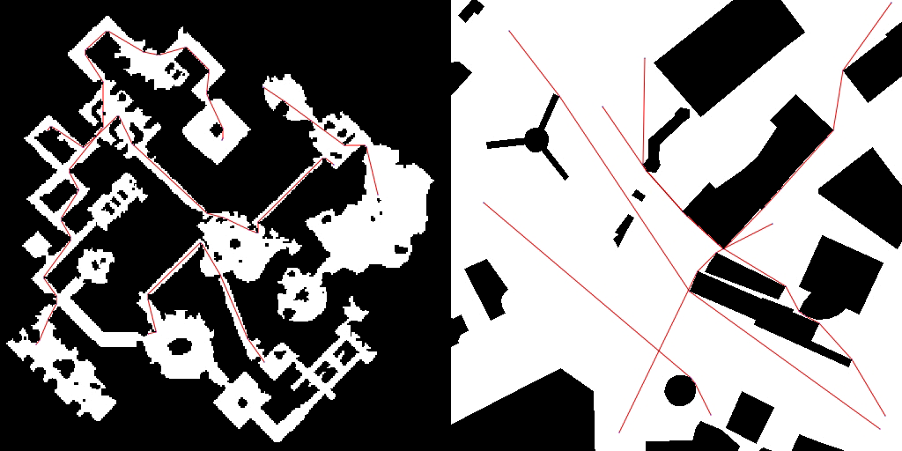

# Pathy

A tool for visualization and benchmarking of pathfinding algorithms (Dijkstra, A, Post-Smoothed A* and Theta*).
The program operates on map and scenarios files from [movingai.com/benchmarks/grids.html](https://www.movingai.com/benchmarks/grids.html)

## Building

Run `go build pathy.go data.go common.go pathfinding.go mapimage.go loader.go` in the `code` directory.
[draw2d](https://godoc.org/github.com/llgcode/draw2d) is required to build this project.

## Use cases

To draw an image based on a map file where each cell is 16x16 pixels, run `pathy draw mapfile.map image.jpg 16`.
To benchmark Dijkstra using start and goal coordinates in 10 trials, run `pathy single mapfile.map 5 5 100 250 dijkstra 10`.
To benchmark Post-Smoothed A* in 5 scenarios in 10 trials, run `pathy multiple scenariosfile.scen astar 5 10`.
